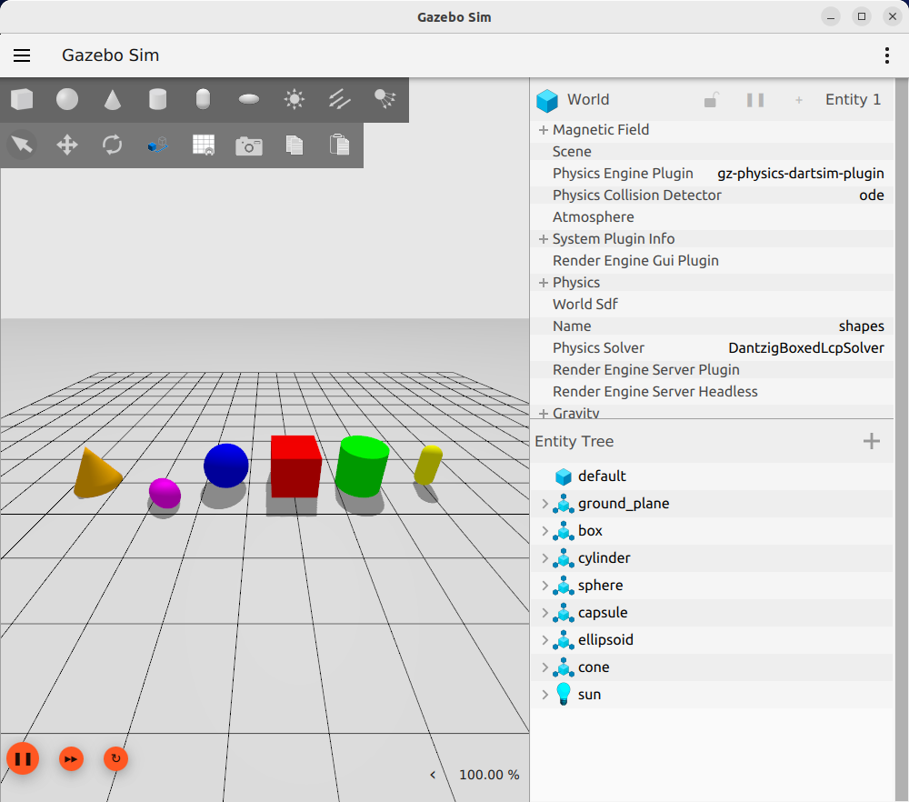

# Jetson-Orin-remote-gazebo-simulation
Instructions to setup and interact remotely with a Gazebo Harmonic simulation on the jetson orin nano with JetPack 6.2 (Ubuntu 22.04 LTS) installed.



### Requirements
You will need a PC/laptop with **Ubuntu 22.04 LTS** connected to the same LAN of the jetson **or** a **Windows 11** PC/laptop with **WSL2** installed. **Windows 10** is unfortunaly more complicated.
___
## Ubuntu 22.04 configuration
### 1. ros2-humble and cycloneDDS
Install ros2-humble both on your **pc** and **jetson** following the
[official guide installation](https://docs.ros.org/en/humble/Installation/Ubuntu-Install-Debs.html)
and make sure to load by default the ros **setup.bash** doing:
```
echo 'source /opt/ros/humble/setup.bash' >> ~/.bashrc
```
After that add the gazebo repository with:
```
sudo curl https://packages.osrfoundation.org/gazebo.gpg --output /usr/share/keyrings/pkgs-osrf-archive-keyring.gpg
echo "deb [arch=$(dpkg --print-architecture) signed-by=/usr/share/keyrings/pkgs-osrf-archive-keyring.gpg] http://packages.osrfoundation.org/gazebo/ubuntu-stable $(lsb_release -cs) main" | sudo tee /etc/apt/sources.list.d/gazebo-stable.list > /dev/null
sudo apt-get update
```
and install **Gazebo Harmonic**:
```
sudo apt-get install gz-harmonic
```
The gazebo-ros bridge is necessary, so install it with:
```
sudo apt install ros-humble-ros-gzharmonic
```
#### CycloneDDS
CycloneDDS manage the ros publisher-subscriber interation, first install [rosdep](https://wiki.ros.org/rosdep#Installing_rosdep) and than install it with:
```
sudo apt install ros-humble-rmw-cyclonedds-cpp
```
if you face some trouble check the [official guide for cyclonedds](https://docs.ros.org/en/foxy/Installation/DDS-Implementations/Working-with-Eclipse-CycloneDDS.html).

**Make sure to do the all the previous steps on both devices (jetson orin and your pc)!!!**.

### 2. connection configuration
For sending the graphical simulation to your pc, the jetson use the **gz-transport** protocol. This protocol needs 3 variables to be set-up for the communication between devices and 2 setting files to connect each other.
Type ```hostname -I``` on both terminal and remember the local ip of each device(jetson and your pc). 

**On Jetson**:

Move to user directory: ```cd ~/```. Create a .conf file with ```nano gz_discovery.conf``` and copy paste this lines (**REMEMBER TO REPLACE "JETSON_IP" AND "YOUR_IP"): 
```
<?xml version="1.0" encoding="UTF-8"?>
<GzTransport>
  <Unicast>
    <HostIp>JETSON_IP</HostIp>
    <Port>11811</Port>
  </Unicast>
  <Unicast>
    <HostIp>YOUR_IP</HostIp>
    <Port>11811</Port>
  </Unicast>
</GzTransport>

```
Now create a .xml file with ```nano cyclonedds.xml``` and copy paste this lines (**REMEMBER TO REPLACE $YOUR_IP**): 
```
<?xml version="1.0" encoding="UTF-8" ?>
<CycloneDDS xmlns="https://cdds.io/config"
            xmlns:xsi="http://www.w3.org/2001/XMLSchema-instance"
            xsi:schemaLocation="https://cdds.io/config https://raw.githubusercontent.com/eclipse-cyclonedds/cyclonedds/master/etc/cyclonedds.xsd">
  <Domain id="any">
    <General>
      <Interfaces>
        <NetworkInterface name="wlP1p1s0" priority="default" multicast="false"/>
      </Interfaces>
    </General>
    <Discovery>
      <Peers>
        <Peer address="$YOUR_IP"/>
      </Peers>
    </Discovery>
  </Domain>
</CycloneDDS>

```
Define the files paths:
```
echo 'export ROS_DOMAIN_ID=0' >> .bashrc
echo 'export CYCLONEDDS_URI=file:///home/jetson/cyclonedds.xml' >> .bashrc
echo 'export RMW_IMPLEMENTATION=rmw_cyclonedds_cpp' >> .bashrc
```
Set the 3 gazebo variables for the connection and write them in the .bashrc file:

```echo 'export GZ_IP=JETSON_IP' >> .bashrc``` to set the jetson ip;

```echo 'export GZ_PARTITION=sim' >> .bashrc``` to set the simulation name (you can change it, but it must be the same on your pc);

```echo 'GZ_RELAY=YOUR_IP' >> .bashrc``` to set the pc ip.

Now load the variables: ```source .bashrc```.

---
**On your pc**

Move to user directory: ```cd ~/```. Create a .conf file with ```nano gz_discovery.conf``` and copy paste this lines (**REMEMBER TO REPLACE "JETSON_IP" AND "YOUR_IP"): 
```
<?xml version="1.0" encoding="UTF-8"?>
<GzTransport>
  <Unicast>
    <HostIp>JETSON_IP</HostIp>
    <Port>11811</Port>
  </Unicast>
  <Unicast>
    <HostIp>YOUR_IP</HostIp>
    <Port>11811</Port>
  </Unicast>
</GzTransport>

```
Type on the terminal ```ifconfig``` and remember your network interface.
Now create a .xml file with ```nano cyclonedds.xml``` and copy paste this lines (**REMEMBER TO REPLACE $JETSON_IP AND $YOUR_NETWORK_INTERFACE**): 
```
<?xml version="1.0" encoding="UTF-8" ?>
<CycloneDDS xmlns="https://cdds.io/config"
            xmlns:xsi="http://www.w3.org/2001/XMLSchema-instance"
            xsi:schemaLocation="https://cdds.io/config https://raw.githubusercontent.com/eclipse-cyclonedds/cyclonedds/master/etc/cyclonedds.xsd">
  <Domain id="any">
    <General>
      <Interfaces>
        <NetworkInterface name="$YOUR_NETWORK_INTERFACE" priority="default" multicast="false"/>
      </Interfaces>
    </General>
    <Discovery>
      <Peers>
        <Peer address="$JETSON_IP"/>
      </Peers>
    </Discovery>
  </Domain>
</CycloneDDS>

```
Define the files paths (**REMEMBER TO REPLACE "YOUR_USER"**):
```
echo 'export ROS_DOMAIN_ID=0' >> .bashrc
echo 'export CYCLONEDDS_URI=file:///home/YOUR_USER/cyclonedds.xml' >> .bashrc
echo 'export RMW_IMPLEMENTATION=rmw_cyclonedds_cpp' >> .bashrc
```
and set the 3 gazebo variables in the .bashrc file as before:

```
echo 'export GZ_IP=YOUR_IP' >> .bashrc

echo 'export GZ_PARTITION=sim' >> .bashrc

echo 'export GZ_RELAY=YOUR_IP' >> .bashrc
```

Now load the variables: ```source .bashrc```.

### 3. start the simulation
Now we are ready to start the simulation.

First of all temporaly disable the firewall on both devices with ```sudo ufw disable``` and **Remember that you need the same model on both device**. Make sure to be on the directory with all the models you need; for example I simply want to simulate a default gazebo world like ```shapes.sdf``` and use this commands:

**On jetson**: ```gz sim -s -r -v4 shapes.sdf``` 
The -v4 parameter is not mandatory, it shows additional information and is useful for troubleshooting.

**On your pc**: ```gz sim -g```. 

At this point gazebo will open the GUI and start the simulatio(it could takes few seconds depending on the size of the .sdf).


